# Plant Disease CNN Benchmark

Comparative benchmark of pretrained CNN architectures for plant disease
classification using transfer learning and fine-tuning.

The objective of this project is not to determine a universally "best"
architecture, but to experimentally compare different CNN architectures
under a controlled training protocol and analyze the trade-off between
predictive performance and computational requirements.

---

# Research Question

Which pretrained CNN architecture offers the best trade-off between
classification performance and computational efficiency for plant disease
recognition?

---

# Features

- Transfer learning with pretrained CNN architectures
- Controlled comparison under a common training protocol
- Fine-tuning of pretrained models
- Macro Precision, Macro Recall and Macro F1 evaluation
- Confusion matrices
- Per-class F1 analysis
- Model parameter comparison
- GFLOPs comparison
- Model size comparison
- Training and validation learning curves
- Reproducible training configuration

---

# Technologies

## Deep Learning

- Python (`3.12.3`)
- PyTorch (`torch==2.14.0`)
- Torchvision (`torchvision==0.29.0`)
- CUDA (`13.0`)

## Data Science

- NumPy (`numpy==2.5.2`)
- Pandas (`pandas==3.0.5`)
- Scikit-learn (`scikit-learn==1.9.0`)

## Visualization

- Matplotlib (`matplotlib==3.11.1`)
- Seaborn (`seaborn==0.13.2`)

## Model Analysis

- THOP (`thop==0.1.1.post2209072238`)

## Utilities

- Pillow (`Pillow==12.3.0`)
- PyYAML (`PyYAML==6.0.3`)
- tqdm (`tqdm==4.70.0`)
- requests (`requests==2.34.2`)

---

# Dataset

The benchmark uses the PlantVillage dataset distributed through Mendeley Data.

Dataset:

[https://data.mendeley.com/datasets/tywbtsjrjv/1](https://data.mendeley.com/datasets/tywbtsjrjv/1)

The experiments use:

`Plant_leave_diseases_dataset_without_augmentation`

The `Background_without_leaves` folder was removed from the dataset before
the experiments because it contains background images rather than plant
disease classes.

After removing this folder, the resulting dataset contains:

- 38 plant disease classes
- 256 × 256 images

---

# CNN Architectures

The benchmark evaluates the following pretrained architectures:

## ResNet

- ResNet18
- ResNet34
- ResNet50
- ResNet101

## MobileNet

- MobileNetV2
- MobileNetV3 Small
- MobileNetV3 Large

## EfficientNet

- EfficientNet-B0
- EfficientNet-B1
- EfficientNet-B2

All models use ImageNet-pretrained weights and are evaluated using the
same general training protocol.

---

# Experimental Methodology

The comparison uses a common experimental protocol across architectures.

## Data Split

The dataset is divided per class into:

- 80% training
- 10% validation
- 10% testing

Random seed: `42`

## Class Imbalance Handling

The training set exhibits significant class imbalance, with per-class
sample counts ranging from 121 to 4405 images. To mitigate this during
training, a `WeightedRandomSampler` is used to oversample
underrepresented classes, with per-class weights computed as the
inverse square root of the class frequency (`1 / sqrt(count)`).

This sampling strategy is applied only to the training set; validation
and test sets use the natural class distribution, ensuring evaluation
reflects real-world class frequencies.

---

## Image Preprocessing

Training images are augmented using the following transformations:

- **Random rotation**: ±15°, with padding matched to the dataset's
  background color to avoid introducing artificial borders
- **Random resized crop**: 256×256, scale (0.85–1.0), aspect ratio
  (0.95–1.05) — a conservative range chosen to keep the full leaf
  within frame
- **Horizontal and vertical flip**: p=0.5 each (leaves have no
  canonical orientation, so both are valid)
- **Color jitter**: brightness/contrast ±0.2, saturation ±0.1, hue
  ±0.02 — saturation and hue were deliberately kept low, since
  disease symptoms in this dataset are often expressed through
  color changes (yellowing, necrotic spots), and more aggressive
  color augmentation was found to visually distort healthy leaves
  into disease-like appearances during preliminary testing
- **ImageNet normalization**: mean/std matched to the pretrained
  backbones' original training distribution

The grid below shows six augmented samples generated from the same
training image under this configuration:

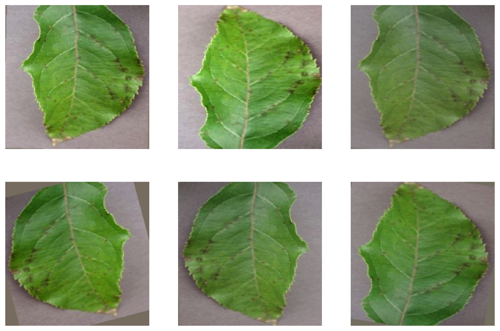

Validation and test images are resized to 256×256 and normalized
using the same ImageNet statistics, without augmentation.

<p align="center">
  
</p>

---

## Training Strategy

Training is performed in two phases.

### Phase 1 — Classifier Training

The pretrained backbone is frozen and only the classifier is trained.

- Optimizer: AdamW, learning rate `3e-4`, weight decay `1e-4`
- Scheduler: CosineAnnealingLR (`T_max=5`)
- Duration: 5 epochs

### Phase 2 — Fine-Tuning

The complete network is unfrozen and fine-tuned using differentiated,
lower learning rates.

- Optimizer: AdamW
  - Backbone: learning rate `5e-6`
  - Classifier head: learning rate `5e-5`
  - Weight decay: `1e-4`
- Scheduler: CosineAnnealingLR (`T_max=25`)

---

## Training Configuration

- Loss: Cross Entropy with label smoothing (`0.1`)
- Maximum epochs: 200
- Early stopping: 10 epochs without improvement
- Early stopping metric: Validation Macro F1
- Batch size: 64 for all architectures, except ResNet101, which
  required a reduced batch size of 32 due to GPU memory constraints
- Input resolution: 256×256 for all architectures
- Checkpointing: full training state saved every epoch, allowing
  training to be resumed after interruption

The same hyperparameter configuration is maintained across architectures
to provide a controlled comparison rather than individually optimizing
each model. The batch size reduction for ResNet101 is the only
exception to this protocol, applied strictly due to hardware
limitations.

---

# Evaluation Metrics

The models are evaluated using:

- Accuracy
- Macro Precision
- Macro Recall
- Macro F1
- Confusion Matrix
- Per-class F1

Macro F1 is used as the primary comparison metric, since it weights
all classes equally regardless of their sample count — relevant given
the class imbalance present in the dataset (class support ranges from
15 to 551 samples).

Computational characteristics are evaluated using:

- Number of parameters
- GFLOPs
- Model size

---

# Results

## Test Results

The following table summarizes the test performance and computational
characteristics obtained for each evaluated architecture.

| Model | Accuracy | Macro F1 | Parameters (M) | GFLOPs | Model Size (MB) |
|---|---:|---:|---:|---:|---:|
| ResNet18 | 99.7789% | 99.7107% | 11.20 | 2.382 | 42.79 |
| ResNet34 | 99.8342% | 99.7995% | 21.30 | 4.804 | 81.41 |
| ResNet50 | 99.8710% | 99.7545% | 23.59 | 5.397 | 90.29 |
| ResNet101 | 99.8158% | 99.7352% | 42.58 | 10.272 | 163.05 |
| MobileNetV2 | 99.6131% | 99.5306% | 2.27 | 0.426 | 8.92 |
| MobileNetV3 Small | 99.6684% | 99.5191% | 1.56 | 0.080 | 6.08 |
| MobileNetV3 Large | 99.7789% | 99.7215% | 4.25 | 0.304 | 16.43 |
| EfficientNet-B0 | 99.7973% | 99.7519% | 4.06 | 0.540 | 15.78 |
| EfficientNet-B1 | 99.6868% | 99.6153% | 6.56 | 0.796 | 25.47 |
| EfficientNet-B2 | 99.7605% | 99.7124% | 7.75 | 0.915 | 30.04 |

## Training and Validation Results

The following table summarizes the training and validation metrics recorded
at the best validation Macro F1 epoch for each architecture.

| Model | Best Epoch | Train Loss | Train Accuracy | Train Macro Precision | Train Macro Recall | Train Macro F1 | Val Loss | Val Accuracy | Val Macro Precision | Val Macro Recall | Val Macro F1 |
|---|---:|---:|---:|---:|---:|---:|---:|---:|---:|---:|---:|
| ResNet18 | 55 | 0.707548 | 99.907896% | 99.903039% | 99.907417% | 99.905176% | 0.711020 | 99.687959% | 99.557337% | 99.482408% | 99.507075% |
| ResNet34 | 73 | 0.678019 | 99.988487% | 99.989005% | 99.987852% | 99.988420% | 0.681462 | 99.834802% | 99.783926% | 99.652242% | 99.713531% |
| ResNet50 | 53 | 0.684625 | 99.983882% | 99.983873% | 99.985497% | 99.984675% | 0.687182 | 99.853157% | 99.826054% | 99.808537% | 99.816746% |
| ResNet101 | 12 | 0.714386 | 99.806581% | 99.780805% | 99.784506% | 99.782510% | 0.710172 | 99.761380% | 99.707766% | 99.584954% | 99.639644% |
| MobileNetV2 | 101 | 0.721066 | 99.806581% | 99.792964% | 99.782242% | 99.787541% | 0.716841 | 99.614537% | 99.558195% | 99.359619% | 99.451389% |
| MobileNetV3 Small | 110 | 0.729248 | 99.730595% | 99.715049% | 99.712530% | 99.713673% | 0.727698 | 99.247430% | 99.220367% | 99.043335% | 99.120345% |
| MobileNetV3 Large | 70 | 0.699268 | 99.917106% | 99.903932% | 99.915412% | 99.909609% | 0.700844 | 99.687959% | 99.670495% | 99.517694% | 99.590050% |
| EfficientNet-B0 | 76 | 0.706433 | 99.873357% | 99.865584% | 99.872955% | 99.869218% | 0.700410 | 99.743025% | 99.657033% | 99.521182% | 99.584403% |
| EfficientNet-B1 | 96 | 0.705905 | 99.776647% | 99.744550% | 99.752051% | 99.748214% | 0.694540 | 99.761380% | 99.704293% | 99.580923% | 99.635532% |
| EfficientNet-B2 | 58 | 0.705478 | 99.850330% | 99.826885% | 99.837886% | 99.832337% | 0.693464 | 99.706314% | 99.673925% | 99.492562% | 99.578531% |

---

# Results Analysis

In response to the research question, the benchmark indicates that **EfficientNet-B0** and **MobileNetV3 Large** provide the most favorable trade-off for this specific task. Both architectures achieved predictive performance highly comparable to the heaviest models (Macro F1 > 99.7%) while requiring only a fraction of the computational cost (< 5M parameters, < 0.6 GFLOPs).

The experiments show that all evaluated architectures achieved high
classification performance on the selected PlantVillage benchmark.

However, increasing model depth or capacity did not produce a monotonic
improvement in Macro F1. For instance, architectures like ResNet34 reached
the peak predictive performance (99.7995% Macro F1) but at a significantly
higher computational expense (4.8 GFLOPs).

The differences in predictive performance between architectures were
relatively small, while their computational requirements varied
substantially.

This demonstrates why model selection should consider both predictive
performance and computational requirements rather than relying exclusively
on classification accuracy.

---

## Results Visualization

The following visualizations are generated directly from the benchmark
results stored in the project's CSV files.

### Macro F1 Comparison

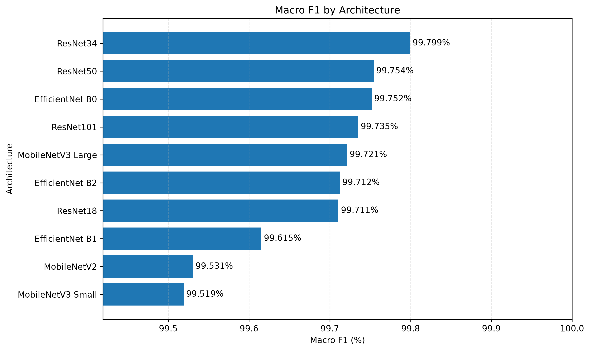

### Macro F1 vs GFLOPs

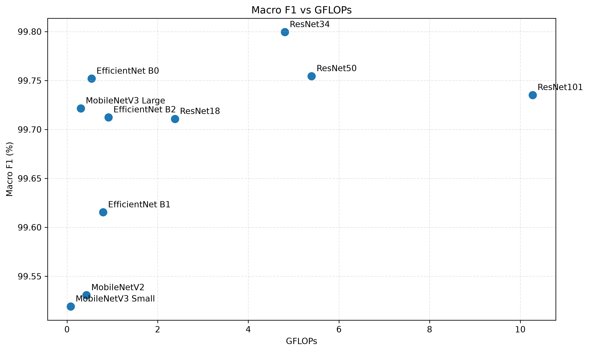

### Macro F1 vs Parameters

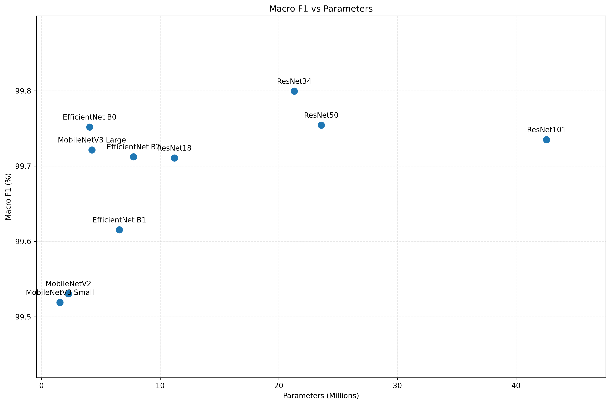

### Macro F1 vs Model Size

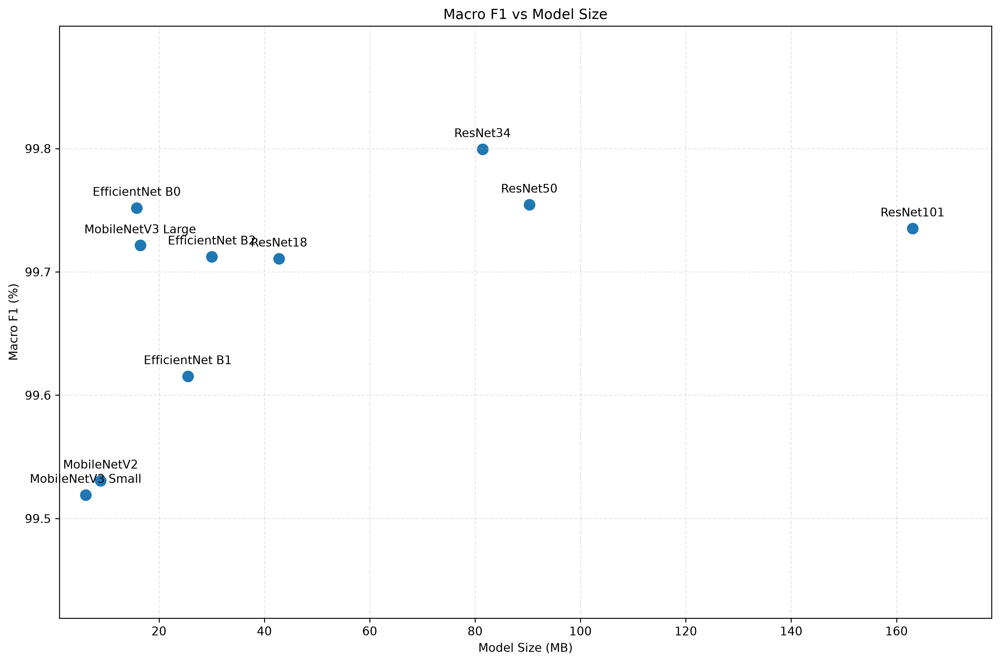

### Accuracy vs Macro F1

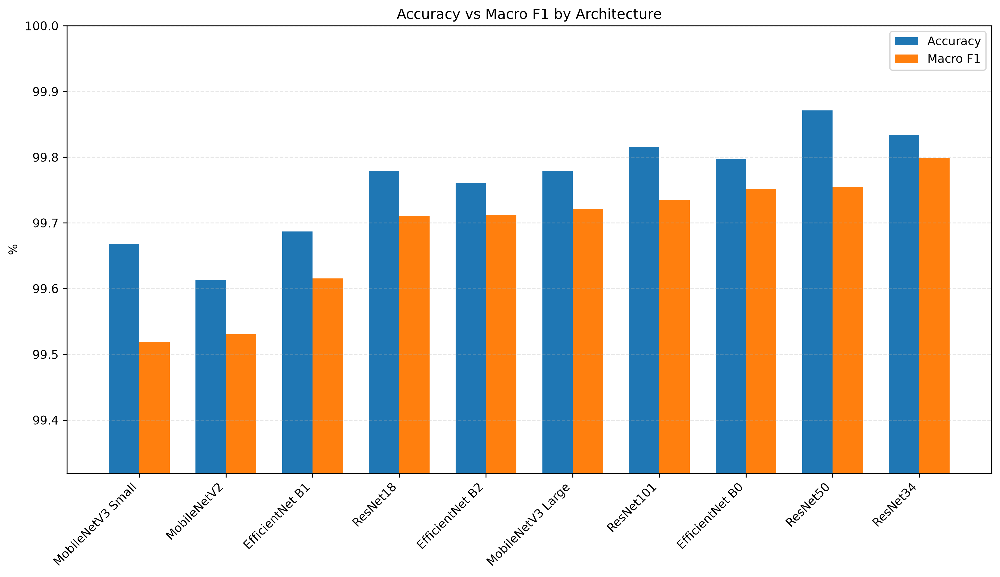

### Macro Precision vs Macro Recall

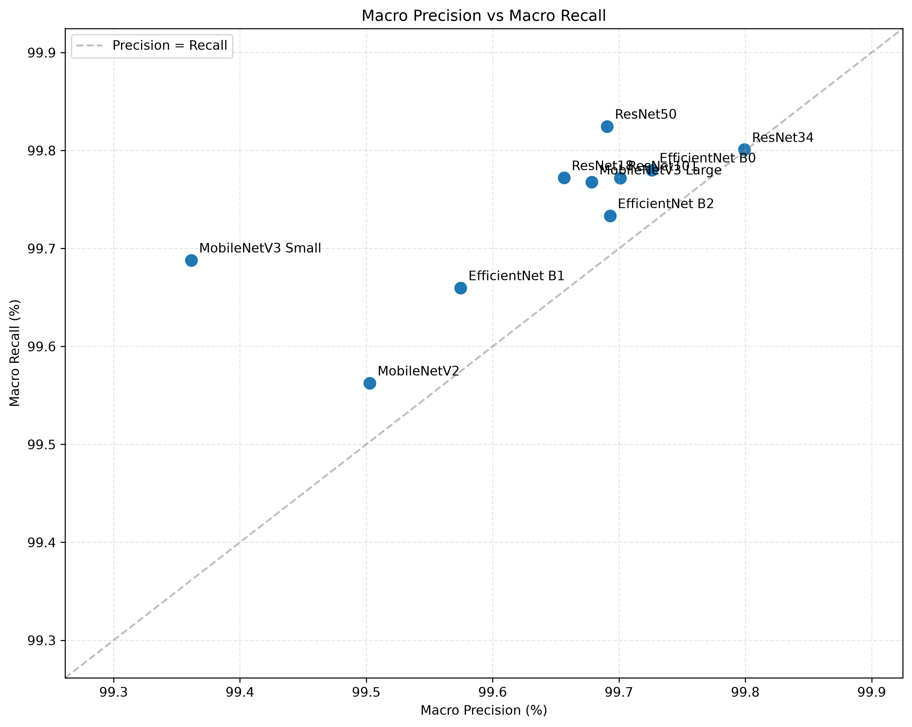

### Classification Metrics Heatmap

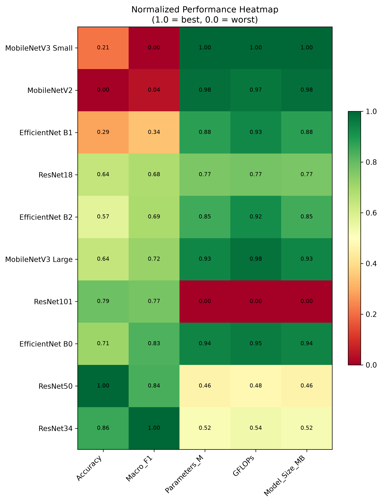

---

## Training and Validation

The following visualizations summarize the training and validation
results recorded at the best validation Macro F1 epoch for each
architecture.

### Epochs to Convergence

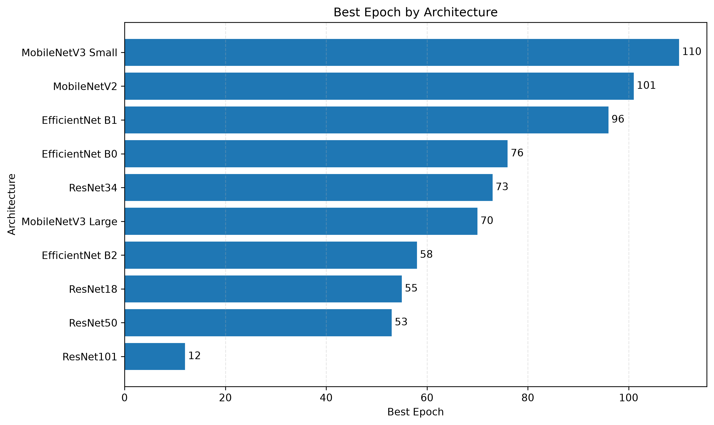

### Train-Validation Macro F1 Gap

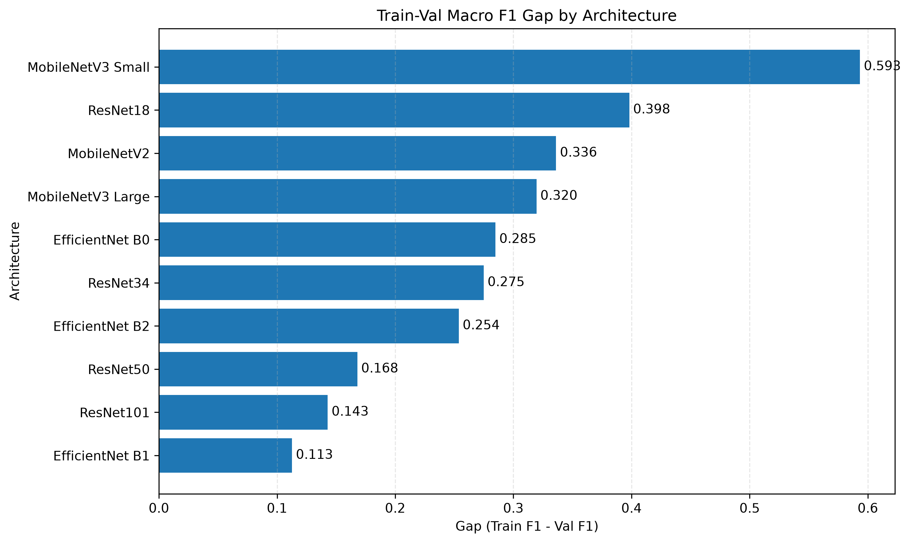

### Train vs Validation Macro F1

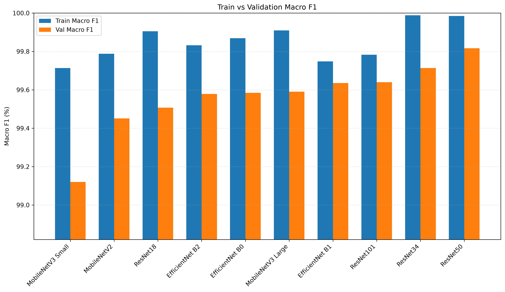

### Best Epoch vs Validation Macro F1

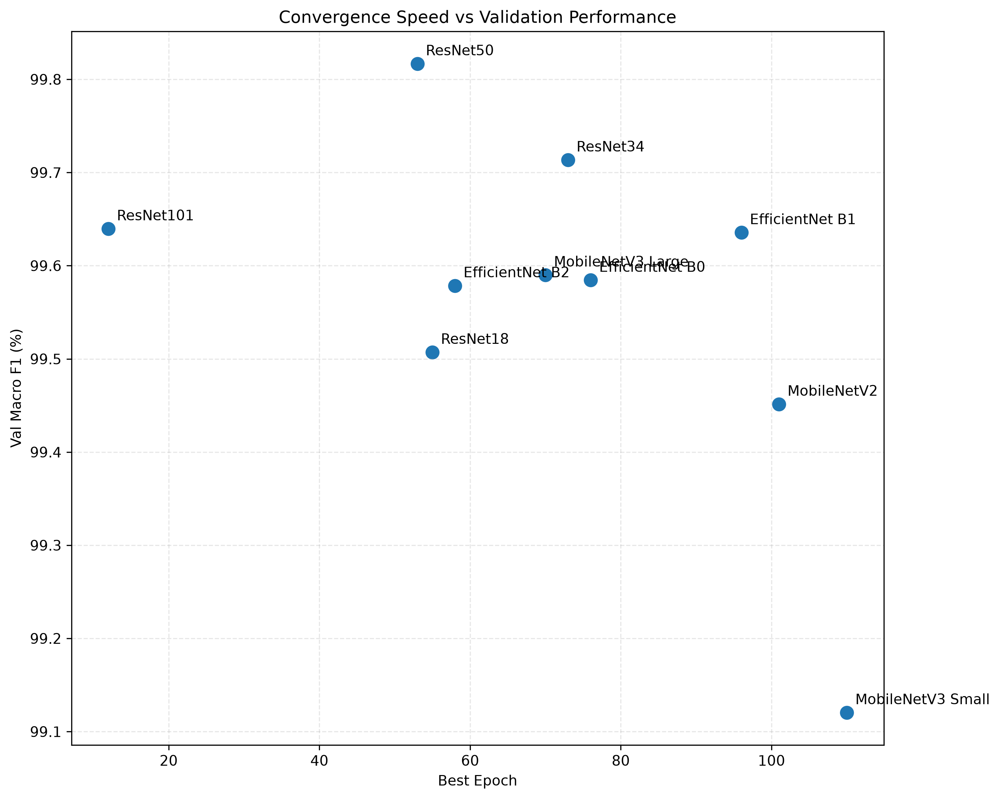

---

## Training Behavior Analysis

The number of epochs required to reach the best validation Macro F1 varied
substantially across architectures, ranging from 12 epochs for ResNet101 to
110 epochs for MobileNetV3 Small. This variation did not show a consistent
relationship with final test performance: architectures reaching their best
validation performance earlier did not necessarily achieve higher test
performance, and vice versa.

The train-validation Macro F1 gap also varied across architectures and did
not show a consistent relationship with either the number of epochs required
to reach the best validation Macro F1 or final test performance. These
differences indicate that training and validation behavior can vary
considerably across architectures under the fixed training configuration
used in this benchmark.

---

## Computational Efficiency

The benchmark also evaluates model complexity using:

- Parameter count
- GFLOPs
- Model size

These measurements provide a hardware-independent reference for comparing
the computational characteristics of the architectures.

Actual inference latency, FPS and peak VRAM usage are not included in the
main benchmark because these measurements depend strongly on the hardware,
batch size and execution environment.

---

# Project Structure

```text
plant-disease-cnn-benchmark/
│
├── dataset/
│   └── dataset_preparation.ipynb
│
├── model/
│   ├── resnet18/
│   ├── resnet34/
│   ├── resnet50/
│   ├── resnet101/
│   ├── mobilenet_v2/
│   ├── mobilenet_v3_small/
│   ├── mobilenet_v3_large/
│   ├── efficientnet_b0/
│   ├── efficientnet_b1/
│   └── efficientnet_b2/
│
├── training/
│   ├── resnet18/
│   ├── resnet34/
│   ├── resnet50/
│   ├── resnet101/
│   ├── mobilenet_v2/
│   ├── mobilenet_v3_small/
│   ├── mobilenet_v3_large/
│   ├── efficientnet_b0/
│   ├── efficientnet_b1/
│   └── efficientnet_b2/
│
├── results/
│   ├── analysis_results.ipynb
│   ├── benchmark_results.csv
│   ├── train_val_results.csv
│   ├── data_augmentation_example/
│   ├── test_graphs/
│   └── train_val_graphs/
│
├── requirements.txt
├── .gitignore
└── README.md
```
> **Note:** Due to GitHub's file size limitations, the ResNet101 best
> weights file (171.0 MB) is excluded from this repository. Checkpoint
> files generated during training for all architectures are also excluded
> for the same reason. The remaining trained model weights that comply
> with GitHub's file size limits are included.

---

## Activate virtual environment

### Linux / macOS

```bash
source .venv/bin/activate
```

### Windows

```bash
.venv\Scripts\activate
```

---

## Install dependencies

```bash
pip install -r requirements.txt
```

---

# Author

Ing. Juan Antonio Barreda Mendez

Computer Systems Engineer focused on:
- Artificial Intelligence
- Deep Learning
- Natural Language Processing (NLP)
- Computer Vision
- Multimodal AI Systems

---

# License

This project is intended for educational, research, and portfolio purposes.

---